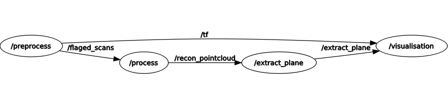
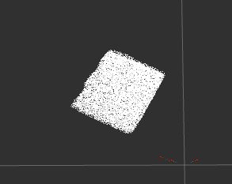

# auto-scanner_hokuyo_ros

Scanning cuboid commodities randomly on conveyor belt for calculating sizes based on HOKUYO 2D-Lidar(UST-10/20LX) and ROS(Robot Operating System).

## The whole pipeline

The whole pipeline organized based on ROS(Robot Operating System). It consists of three nodes: `preprocess_node`, `process_node`, `extract_plane_node`.

* `preprocess_node`: subscribes `/scan` topic published by `urg_node` node which belong to official package `urg_node`, and publishes `/flaged_scans` topic which contains self-defined ros-message `FlagedScan`(the message contains interested part which is arounding conveyor belt and cuboid commodities), `/tf` topic for tranformation.
* `process_node`: subscribes `/flaged_scans` topic published by `preprocess_node` node, and publishes `/recon_pointcloud` topic which contains ros standard message `sensor_msgs::PointCloud`(this step need additional information, rate of conveyor belt, to calculate 3D pointcloud).
* `extract_plane_node`: subscribes `/recon_pointcloud` topic published by `process_node` node, and convert data type of pointcloud from `sensor_msgs::PointCloud` to `pcl::PointCloud<pcl::PointXYZ>`. Nextly, extract top plane of pointcloud of cuboid commodity. Lastly, calculate the minimum rectangle which can contain the whole top plane.

ROS graph of nodes:



## Build and Run 

* Install and configure ROS environment [(roswiki install)](http://wiki.ros.org/cn/ROS/Tutorials/InstallingandConfiguringROSEnvironment).

* Clone repo into your ros workspace(if you follow the tutorial, default workspace is `catkin_ws`).

  ```shell
  cp –r <clone repo derectory>/all_in_one ~/catkin_ws
  cd ~/catkin_ws/
  catkin_make
  ```

* Run with `roslaunch`

  ```shell
  roslaunch all_in_one auto_scanner.launch
  rosbag play <your rosbag>
  ```

## Result

raw scan data from HOKUYO 2D-Lidar:


point cloud recontructed from raw scan data:


extracted plane in the from of point cloud:



sum of cuboid commodities and its sizes(length, width, height):


